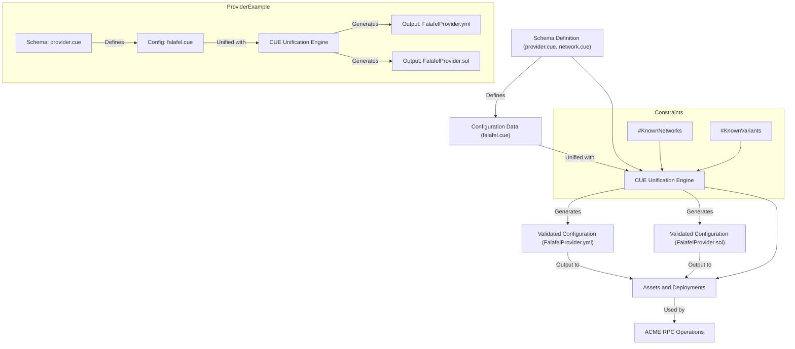

# CUE Best Practices

## Build time with zsh

```console
➜ time make build
make[1]: Entering directory 'cue-help/cue/chains'
make[1]: Leaving directory 'cue-help/cue/chains'
make[1]: Entering directory 'cue-help/cue/providers'
make[1]: Leaving directory 'cue-help/cue/providers'

================
CPU     254%
user    2:24.05
system  3.880
total   58.104
```

- [ ] Does CUE have best practices guidance?
- [ ] How to measure unification big O?

## CUE_STATS_FILE

Using CUE_STATS_FILE... environment settings .. what does it mean?

```console
➜ make perf
Perf cue/chains
CUE_STATS_FILE=cue:chains-perf cue cmd make
CUE: {
        Unifications: 74
        Disjuncts:    112
        Conjuncts:    180
        Freed:        101
        Reused:       86
        Allocs:       16
        Retained:     13
}
Go: {
        AllocBytes:   10833019816
        AllocObjects: 113004896
}
Perf cue/providers
CUE_STATS_FILE=cue:providers-perf cue cmd make
CUE: {
        Unifications: 74
        Disjuncts:    112
        Conjuncts:    180
        Freed:        101
        Reused:       86
        Allocs:       16
        Retained:     13
}
Go: {
        AllocBytes:   28503664824
        AllocObjects: 287209154
}
```

# Overview

This document provides an overview of the CUE configuration files in the
conf/rpc directory. It covers:

- The schematic relationship between the files.
- Instructions on how to add a new chain with variants.
- Instructions on how to add a new provider.

Additionally, note that the calculation for all providers except Falafel uses
the bitmask of the complete set of network methods, while Falafel uses a subset
of methods.

## What is Being Generated
The CUE configuration in this directory generates configurations for various
RPC (Remote Procedure Call) services. These configurations include definitions
for chains, providers, and their respective variants.

## Chains
Chains represent blockchain networks (e.g., Ethereum, Bitcoin). Each chain can
have multiple variants representing different environments (e.g., mainnet,
testnet). A Yaml and a Solidity contract is generated for every chain variant
definition.

## Providers
Providers are services that offer connectivity and interactions with the
chains. Each provider may support a different set of methods for interacting
with the chain. A Yaml and Solidity contract is generated for every Provider
definition.

## Workflow

This example shows how `provider/falafel.cue` is processed.




## Project Structure

```console
# CUE definitions                # Generated config
==================================================================================

conf/rpc/                         build
├── chains/                       ├── conf
│   ├── chain1.cue                │   ├── chains
│   ├── chain2.cue                │   │   ├── ArbitrumMainnet.yml
│   └── ...                       │   │   ├── ...
├── providers/                    │   │   └── ZksyncSepolia.yml
│   ├── provider1.cue             │   └── providers
│   ├── provider2.cue             │       ├── BerryProvider.yml
│   └── ...                       │       ├── ...
└── config.cue                    │       └── ZheProvider.yml
                                  └── sol
                                      ├── chains
                                      │   ├── ArbitrumMainnetEndpointCollection.sol
                                      │   ├── ...
                                      │   └── ZksyncSepoliaEndpointCollection.sol
                                      └── providers
                                          ├── BerryProvider.sol
                                          ├── ...
                                          └── ZheProvider.sol
```

## Adding a New Chain with Variants
To add a new chain with its variants, follow these steps:

1. Create a new CUE file for the chain in the chains/ directory. Name it
   appropriately (e.g., newchain.cue).
1. Define the chain and its variants in the new CUE file. For example:
   ```cue
   // Define the different variants
   _newchainMainnet: schema.#Network & {
       name:        "newchain"
       flavor:      "mainnet"
       description: "Description of the newchain mainnet"
       version:     "1.0.0"
       methods:     #allNewchainMethods
   }

   _newchainTestnet: schema.#Network & {
       name:        "newchain"
       flavor:      "testnet"
       description: "Description of the newchain testnet"
       version:     "1.0.0"
       methods:     #allNewchainMethods
   }

   // Add the `newchain/mainnet` and `newchain/testnet` paths to the result object
   result: result & {
       newchain: {
           mainnet: _newchainMainnet
           testnet: _newchainTestnet
       }
   }
   ```
1. Define the #KnownNetworks and the associated #KnownVariants in the main
   configuration file or the appropriate location.
   ```cue
   // Add the new chain and its variants to the known networks and variants
   #KnownNetworks: #KnownNetworks & ["newchain"]
   #KnownVariants: #KnownVariants & ["newchain/mainnet", "newchain/testnet"]
   ```

## Adding a New Provider

To add a new provider, follow these steps:

1. Create a new CUE file for the provider in the providers/ directory. Name it
   appropriately (e.g., newprovider.cue).
1. Define the provider and its supported methods in the new CUE file. For
   example:
   ```cue
   package providers
   
   newprovider: {
       name: "NewProvider"
       methods: {
           eth_blockNumber: true
           eth_getBalance:  true
           // Define other methods supported by the provider
       }
   }
   ```
1. Configure the provider for a specific chain in config.cue. For example:
   ```cue
   newProvider: {
      polygon: {
          mainnet: endpoint_details: url: "..."
          testnet: endpoint_details: url: "..."
      }

      ... other chain configurations
   }
   ```

## Bitmask Calculation for Network Methods

For all providers except Falafel, the bitmask calculation uses the complete set
of network methods. The Falafel provider uses a subset of methods for its
bitmask calculation. Ensure to handle the method definitions accordingly in the
provider's CUE file.

